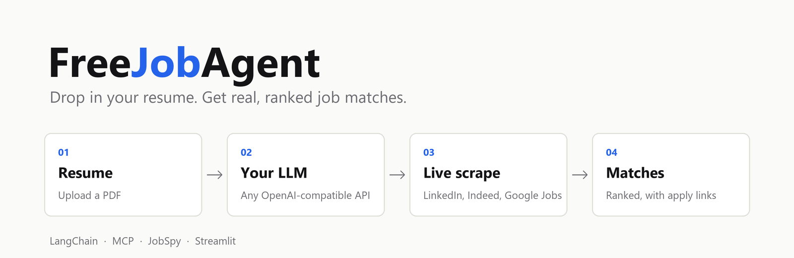

<div align="center">
  
</div>

<br />

**FreeJobAgent** reads your PDF resume, scrapes live openings from **LinkedIn**, **Indeed** and **Google Jobs**, and asks an LLM of your choice to rank the best matches, with apply links and tailored application tips.

It works with **any OpenAI-compatible API** (OpenAI, OpenRouter, Groq, Gemini, Ollama, LM Studio, ...). You supply an API key and a base URL; the app fetches the list of available models from that URL for you.

---

## How it works

```
PDF resume ──► Streamlit UI ──► LangChain agent ──► MCP server ──► JobSpy ──► LinkedIn / Indeed / Google Jobs
                                      │
                                      └── your LLM (LLM_BASE_URL + LLM_API_KEY)
```

1. You upload a resume and (optionally) tweak work type, experience level and location.
2. The agent extracts your role, seniority and location, then calls two MCP tools: a filtered job search and a broader second pass.
3. Results are ranked and shown with company, location, salary (when listed), an apply link and why it matches.

Job scraping uses [JobSpy](https://github.com/speedyapply/JobSpy): free, no scraper API key needed.

---

## Quick start

**Requirements:** Python 3.13+ and [uv](https://docs.astral.sh/uv/) (`pip install uv`).

### 1. Clone and install

```bash
git clone https://github.com/Aryan-Pardeshi/FreeJobAgent.git
cd FreeJobAgent
uv sync
```

### 2. Add your API key and base URL to `.env`

```bash
cp .env.example .env        # on Windows PowerShell: Copy-Item .env.example .env
```

Open `.env` and set the two required variables:

```env
LLM_API_KEY=your_api_key_here
LLM_BASE_URL=https://api.openai.com/v1

# Optional: model preselected in the UI
# LLM_MODEL=gpt-4o-mini
```

| Variable | Required | Description |
|----------|----------|-------------|
| `LLM_API_KEY` | yes | API key for your provider. For local servers that ignore auth (Ollama, LM Studio) put any non-empty placeholder. |
| `LLM_BASE_URL` | yes | Base URL of an OpenAI-compatible API, usually ending in `/v1`. |
| `LLM_MODEL` | no | Model to preselect in the UI. If it is not in the fetched list, the first model is used. |

Common base URLs:

| Provider | `LLM_BASE_URL` |
|----------|----------------|
| OpenAI | `https://api.openai.com/v1` |
| OpenRouter | `https://openrouter.ai/api/v1` |
| Groq | `https://api.groq.com/openai/v1` |
| Google Gemini | `https://generativelanguage.googleapis.com/v1beta/openai/` |
| Ollama (local) | `http://localhost:11434/v1` |
| LM Studio (local) | `http://localhost:1234/v1` |

> The model you pick must support **tool / function calling**, since the agent uses it to call the job-search tools.

### 3. Run

```bash
uv run streamlit run main.py
```

Open <http://localhost:8501>, upload your resume, pick a model in the sidebar and click **Find Matching Jobs**.

---

## Model list

The app calls `GET {LLM_BASE_URL}/models` with your key (`Authorization: Bearer ...`) and fills the sidebar model picker from the response. It understands the standard OpenAI format (`{"data": [{"id": "..."}]}`) and a few common variants.

- The list is cached for 5 minutes; use **Refresh models** in the sidebar to reload it.
- If the endpoint does not exist or the request fails, the app shows the reason and falls back to a text box where you can type a model name manually.

---

## Project structure

```
├── main.py              # Streamlit UI (entry point)
├── mcp_server.py        # FastMCP server exposing the job-search tools
├── src/
│   ├── agent.py         # LangChain agent wired to the MCP tools
│   ├── llm_config.py    # Env settings + model-list fetching
│   ├── job_api.py       # JobSpy wrapper
│   └── fetch_location.py# IP geolocation via ip-api.com
├── assets/banner.png    # README / sidebar image
├── .env.example         # Copy to .env and fill in
└── pyproject.toml       # Dependencies (managed with uv)
```

MCP tools exposed by `mcp_server.py`: `search_jobs_tool` (filtered), `search_jobs_broad_tool` (broader second pass) and `list_supported_sites`.

## Tech stack

| Component | Technology |
|-----------|-----------|
| UI | Streamlit |
| Agent | LangChain + LangGraph, any OpenAI-compatible LLM |
| Tool protocol | MCP via FastMCP |
| Job scraper | JobSpy (LinkedIn, Indeed, Google Jobs) |
| Resume parser | PyPDFLoader |
| Location | ip-api.com (free) |
| Packaging | uv |

## Troubleshooting

- **"Missing LLM_API_KEY / LLM_BASE_URL"**: create `.env` in the project root (see step 2) and restart the app.
- **401 / 403 when loading models**: the key is wrong or does not belong to that base URL.
- **Model list empty or unavailable**: some providers do not expose `/models`; type the model name in the fallback box.
- **Agent errors mentioning tools**: choose a model with tool-calling support.
- **Few or no jobs**: LinkedIn and Indeed rate-limit scrapers. Wait a bit, broaden the location, or try a different work type. The agent passes the country to Indeed based on your location.

## Notes

- `python-jobspy` pins `numpy==1.26.3`, which has no wheels for Python 3.13+. `pyproject.toml` overrides it (`[tool.uv] override-dependencies`) so a plain `uv sync` works.
- Your resume text is sent to the LLM provider you configure. Use a local model (Ollama, LM Studio) if that is a concern.
